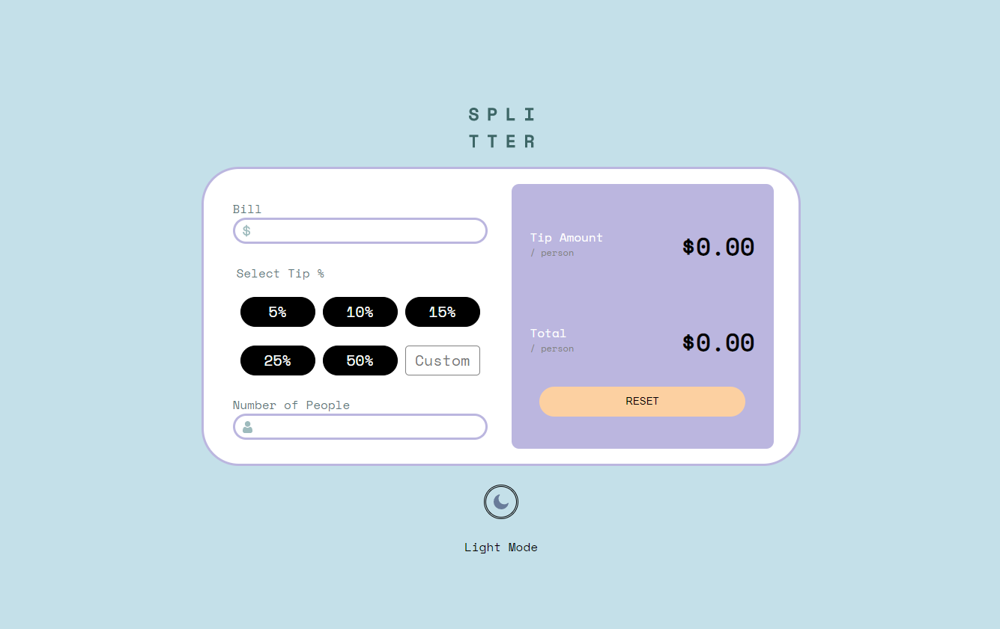

# Tip calculator app 

This is a solution to the [Tip calculator app challenge on Frontend Mentor](https://www.frontendmentor.io/challenges/tip-calculator-app-ugJNGbJUX).

### Capabilities 

Users should be able to:

- View the optimal layout for the app depending on their device's screen size
- See hover states for all interactive elements on the page
- Calculate the correct tip and total cost of the bill per person
- Switch between a light mode and a darkmode

### Screenshot

### Links

- Live Site URL: https://jolly-liskov-07c94f.netlify.app/

### Built with

- Semantic HTML6 markup
- CSS 
- Flexbox
- CSS Grid

## Author

- Website - [Navier Polanco](https://github.com/Navip10)

